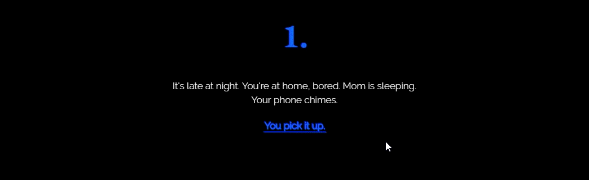
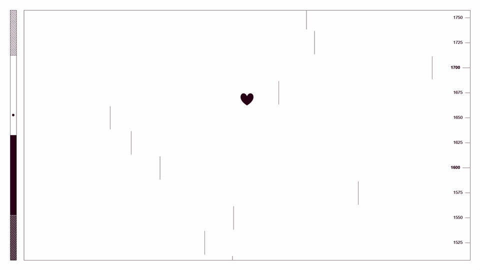
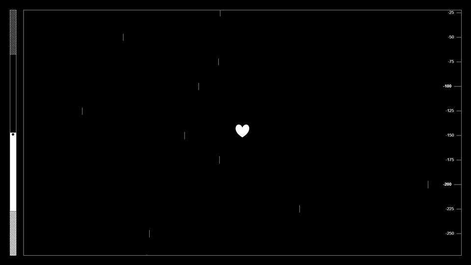
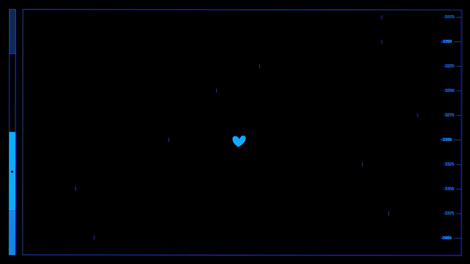

<br>

## About
Cold Turkey is a web experience built on [p5.js](https://p5js.org) with the aim of exploring the tolls and symptoms of heroin addiction.<br>
Cold Turkey was developed as a part of the Creative Coding course at Politecnico di Milano.

## Table of Contents
1. [Project Idea](#project-idea)
2. [Interaction](#interaction)
3. [Key Features](#key-features)<br>
a. [Twine-style opening](#twine-style-opening)<br>
b. [Multiple tiling windows](#multiple-tiling-windows)<br>
c. [Vertical scrolling with culling](#vertical-scrolling-with-culling)<br>
d. [Animated waves and splash](#animated-waves-and-splash)<br>
e. [Time-based movement](#time-based-movement)<br>
f. [Kaleidoscope effect](#kaleidoscope-effect)<br>
g. [Post-processing and blending modes](#post-processing-and-blending-modes)<br>
4. [Team](#team)

## Project Idea
We chose not to explicitly show drug use in our project; instead, we employ one central metaphor, that of *depth* and *altitude*. In this experience, the player avatar's altitude level represents the emotional reaction to drug use: the high obtained from consumption is represented by high altitudes, while the pits of abstinence are represented by the lowest depths.<br>
As the experience progresses, the player will find it harder and harder to reach the same high, simulating addiction, and eventually more information about the symptoms of consumption will become available, providing an option to break the cycle and reach balance once again.

## Interaction
The experience is designed to be played on a computer, as interaction revolves around the keyboard. The spacebar is the designated key for drug intake and it is the only interaction possible in the first half of the experience; additional keys are necessary in the second half, in order to reach the only positive ending.

## Key Features
We hereby present some of the most noteworthy features of our project.
#### Twine-style opening
<br>
To provide context and immerse the player in the experience, we use a short story requiring a minimum of interactivity to present a possible scenario where drug addiction can start. This story reaches its conclusion in one of the three possible endings the player can reach, two of which result from failure to complete the experience.<br>
This format is a simplified version of a [Twine](http://twinery.org/) story.
#### Multiple tiling windows
The screen is, at any moment, divided in up to three windows.
The central window is the most important: it offers a vertically scrolling view of the player's depth, in a sort of a zoomed-in state.<br>
The left window is a height meter which shows the player's total depth compared to the world.
The right window illustrates the symptoms of drug consumption over the user's body and the keyboard keys the player is required to press.<br>
The central window is the only one which is visible from the start, where it occupies the entire screen. Its width changes dynamically to accomodate the other two, at each side of the screen.

```javascript
let gameState=0; //0: game is paused; 1: only center window and meter; 2: all windows
let jumpAmount=29; //progressively decreasing jump amount, as explained later, is used to measure the passage of time

let meterWidth=25;
let meterPos=-70;
const padding = 40;
let mainLSide = padding; //main window left side
let mainRSide = 900; //main window right side

function draw() {
  if (gameState==0) {
    mainRSide=width-padding;
  }
  if (gameState==1&&jumpAmount<28) {
    meterPos=lerp(meterPos,0,0.02);
    mainLSide=lerp(mainLSide, padding+meterWidth+padding*.75,0.02);
    if (jumpAmount<2) {
      gameState=2;
    }
  }
  if (gameState==2) {
    mainRSide=lerp(mainRSide,width-padding*1.75-500,0.02);
  }
}
```
#### Vertical scrolling with culling
<br>
To simulate scrolling on the main window, we do not move the player avatar (to be precise, we move it partially according to its speed to simulate inertia); instead, we move all other elements vertically.<br>
The variable `vOffset` controls all scrolling behaviour; it is an indicator of height. All elements that are meant to scroll are translated by this variable. <br>
All of these are mapped to height and therefore will not be present on the screen at all times. For this reason, we *cull*, or hide, elements that are outside the window for performance reasons (otherwise, we would need to render 20 000 instances of text alone every frame). To prevent pop-in, we move points of larger objects, such as rectangles, to make them fit the window.
```javascript
function cullPoint(INPUT) {
  if (INPUT <= padding) {
    return padding;
  } else if (INPUT >= height - padding) {
    return height - padding;
  } else {
    return INPUT;
  }
}
```
As an example, this is the code for the depth meter on the right side of the main window. Unlike the one in the left window, this one scrolls vertically, displaying the avatar's altitude.
```javascript
for (i = topValue; i < bottomValue; i += 1) {
  let iToPx = i * 4 * 25;
  let lineWidth = 20;
  let vPos = height / 2 + iToPx + vOffset;
  if (vPos < height - padding && vPos > padding) {
    textStyle(NORMAL);
    if (i % 4 === 0) {
      lineWidth = 30;
      textStyle(BOLD);
    }
    line(mainRSide - lineWidth, vPos, mainRSide, vPos);
    push();
    noStroke();
    fill(255);
    if (vPos < height - padding - 7 && vPos > padding + 7) {
      text(-i * 25, mainRSide - lineWidth - 10, vPos);
    }
    pop();
  }
  //kinetic lines
  if (vPos < height && vPos > 0) {
    let linePos = map(randomPos[i - topValue], 0, 1, mainLSide + 10, mainRSide - 100) + cos(millis()*0.06 / 100 + randomPos[i - topValue] * 360) * 5;
    let topPos = vPos - 3 * speed - random(0, 2);
    let bottomPos = vPos + 3 * speed + random(0, 2);
    topPos = cullPoint(topPos);
    bottomPos = cullPoint(bottomPos);
    line(linePos + hNoise / 10, topPos, linePos + vNoise / 10, bottomPos);
  }
}
```
#### Animated waves and splash
<br>
To depict the water surface, we adapted the [Noise Wave](https://p5js.org/examples/math-noise-wave.html) code found on the p5.js website's example section.
```javascript
beginShape();
let xoff = 0;
for (let x = mainLSide; x <= mainRSide; x += 10) {
  let y = map(noise(xoff, yoff), 0, 1, height / 2 - 20 + vOffset, height / 2 + 20 + vOffset);
  y=cullPoint(y);
  //duplicating the last vertex to cover full width
  vertex(x, y);
  xoff += 0.05;
  if (x > mainRSide - 10) {
    vertex(mainRSide, y);
  }
}
yoff += 0.01;
//last two vertices at window bottom.
vertex(mainRSide, padding);
vertex(mainLSide, padding);
endShape(CLOSE);
```
The splash animation, which plays when the player avatar collides with the water surface, is an animated bezier curve, with offset based on player speed. Physically simulated bubbles are added for effect.
```javascript
let splashing = 0;
//the animation has three states.
if (splashing && splashState == 0 || splashing && splashState == 2) {
  splashSpeed = speed;
  splashState = 1;
} else if (splashState == 1) {
  splashAmount = lerp(splashAmount, 100, 0.1);
}
if (splashAmount > 99 && splashState == 1) {
  splashState = 2;
} else if (splashState == 2) {
  splashAmount = lerp(splashAmount, 0, 0.02);
}
if (splashState == 2 && splashAmount < 1) {
  splashState = 0;
}
//splashes are objects. The splashAmount and splashSpeed (based on player speed) vars control their height.
new Splash(50, splashAmount * 1.5 * 0.2 * abs(splashSpeed), 0);
new Splash(40, splashAmount * 0.6 * 0.2 * abs(splashSpeed), -50);
new Splash(30, splashAmount * 0.6 * 0.2 * abs(splashSpeed), +60);
pop();
//Bubbles are created in an array in the setup() function.
for (j = 0; j < bubbles.length; j++) {
  var bubGravity = createVector(0, 0.05 * bubbles[j].mass);
  bubbles[j].applyForce(bubGravity);
  if (splashState == 1 && bubbles[j].position.y > -20) {
    bubbles[j].velocity.y = -0.1 * abs(speed) / bubbles[j].mass;
  }
  bubbles[j].update();
  bubbles[j].display();
  bubbles[j].checkEdges();
}
```
Here we show the splash and bubble objects, along with the functions required for gravity simulation, obtained from [this example](https://p5js.org/examples/simulate-forces.html).
```javascript
function Splash(WIDTH, HEIGHT, OFFSET) {
  this.topVertex = height / 2 + vOffset + 15 - HEIGHT;
  this.bottomVertex = height / 2 + vOffset + 15;
  this.topVertex = cullPoint(this.topVertex);
  this.bottomVertex = cullPoint(this.bottomVertex);
  beginShape();
  curveVertex(center.x - WIDTH + OFFSET - 100, this.bottomVertex);
  curveVertex(center.x - WIDTH + OFFSET, this.bottomVertex);
  curveVertex(center.x + OFFSET, this.topVertex);
  curveVertex(center.x + WIDTH + OFFSET, this.bottomVertex);
  curveVertex(center.x + WIDTH + OFFSET + 100, this.bottomVertex);
  endShape();
}
function Bubble(X, Y, SIZE, BRIGHTNESS) {
  this.position = createVector(X, Y);
  this.velocity = createVector(0, 0);
  this.acceleration = createVector(0, 0);
  this.mass = SIZE * 0.01;
  this.display = function() {
    if (this.position.y + height / 2 + vOffset < height - padding - SIZE / 2 && this.position.y + height / 2 + vOffset > padding + SIZE / 2) {
      push();
      noStroke();
      fill(BRIGHTNESS);
      ellipse(this.position.x + center.x, this.position.y + height / 2 + vOffset, SIZE);
      pop();
    }
  }
}
Bubble.prototype.applyForce = function(force) {
  let f = p5.Vector.div(force, this.mass);
  this.acceleration.add(f);
}
Bubble.prototype.update = function() {
  this.velocity.add(this.acceleration);
  this.position.add(this.velocity);
  this.acceleration.mult(0);
}
Bubble.prototype.checkEdges = function() {
  if (this.position.y > 20) {
    this.velocity.y = 0;
    this.position.y = 20;
  }
}
```
#### Time-based movement
During testing, we noticed wildly varying performance across different hardware, operating systems, and browsers. Letting gravity affect movement based on framerate (such as running `vOffset+=1` every draw cycle) rendered the experience painfully slow in some cases.
Therefore, we calculate speed and position based on time, through p5.js' `millis()` function.<br>
A `delta` variable determines the amount of time passing between each frame, so that speed increments can be consistent.
```javascript
function draw() {
  now = millis();
  delta = now - then;
  vOffset += calcSpeed(delta,speed);
  speed += calcSpeed(delta,-gravity);
  then=now;
}
function calcSpeed(DELTA,SPEED) {
  return (SPEED*DELTA)*0.06;
}
```
Bubbles do not use time-based movement.
#### Kaleidoscope effect
<br>
To hint at the effects of a high, we have a kaleidoscope effect played around the player avatar at high altitudes. The following functions are adapted from [this](https://cs.anu.edu.au/courses/comp1720/labs/05-kaleidoscope/) page.
```javascript
//Used to duplicate elements to form "slices" in a kaleidoscope.
function calcStuff(width, height, s) {
  // because pythagorean theorem
  // h = sqrt(a^2 + b^2)
  // a = sqrt(h^2 - b^2)
  // b = sqrt(h^2 - a^2)
  let a = sqrt(sq(width/2)+sq(height/2));
  let theta = radians(360 / s);
  let o = tan(theta) * a;
  let h = a / cos(theta);
  return {a: round(a), o: round(o), h: round(h)};
}
function createMask(w,h) {
    mask = createImage(w,h);
    mask.loadPixels();
    for (i = 0; i < mask.width; i++) {
        for (j = 0; j < mask.height; j++) {
            if(i >= map(j,0,h,0,w)-1) // -1 removes some breaks
                mask.set(i, j, color(255));
        }
    }
    mask.updatePixels();
    return mask;
}
//A portion of the drawing, obtained through get(), is duplicated and masked according to the previous functions.
function mirror(img) {
    img.mask(mask);
    push();
    translate(width/2,height/2);
    rotate(radians(frameCount/3));
    for(var i=0; i<slices; i++) {
      if(i%2==0) {
        push();
        scale(1,-1); // mirror
        image(img,0,0); // draw slice
        pop();
      } else {
        rotate(radians(360/slices)*2); // rotate
        image(img,0,0); // draw slice
      }
    }
    pop();
}
```
At the beginning of the draw cycle, we render several instances of an image, moving in various ways (mostly sine curves), and capture this into an image via `get()`.<br>
This is not visible in the final result, as we draw a second background on top of it all.<br>
```javascript
const slices = 12;
let shape, mask, img;
let kalSize, offScreen;
let kalAlpha = 0;
function preload() {
  kaleido = loadImage("./images/kaleido.png");
}
function setup() {
  shape = calcStuff(width,height,slices);
  mask = createMask(shape.a,shape.o);
}
function draw() {
  kalSize=height*1.2;
  offScreen = createVector(0,0);
  blendMode(BLEND);
  fill(255);
  noStroke();
  rect(offScreen.x,offScreen.y,kalSize,kalSize);
  imageMode(CENTER);
  for(i=0;i<6;i++) {
    image(kaleido,offScreen.x+kalSize/2+i*50+cos(millis()/5000+i*60)*60+100,offScreen.y+kalSize/2+cos(millis()/6000+i*60)*kalSize/2,kalSize,kalSize/5);
  }
  fill(255,1-kalAlpha);
  rect(-width,-height,width*3,height*3);
  kalCopy = get(width/2,padding,kalSize,kalSize);
  fill(bgBrightness);
  noStroke();
  blendMode(BLEND);
  rect(0,0,width,height);
}
```
Through the `mirror()` function listed above, the image is masked and duplicated later, right before the player avatar is rendered.
```javascript
mirror(kalCopy);
```
#### Post-processing and blending modes
<br>
To represent the varying conditions of distress of the subject, we use some techniques that let us change the appearance of the entire screen.<br>
First of all, with negative altitude the whole image becomes white on black, while positive altitudes invert these colors. This is achieved in part through use of a global `bgBrightness` variable, and in part through use of p5.js' color blending modes; in particular, `blendMode(DIFFERENCE)`. This means that elements such as the player avatar and the depth indicator are always rendered in the inverse color of their background. It is not necessary, therefore, to manually change fill colors for most elements depending on altitude.<br>
Furthermore, we use what might be described as post-processing effects to change the color of the whole screen. We draw colored rectangles with `MULTIPLY` or `ADD` blend modes on top of the screen, which would otherwise be in black and white. <br>
Through the `get()` function, we can also duplicate the whole image and apply noise and effects to create interesting visual results.<br>
We use the `mapVar` variable to blend these effects.
```javascript
var snapShot = get();
let n = noise(millis() / 30 * 0.1) * mapVar;
let scaleAm = 1 + n / 160;
let satVar = (millis() / 100) % 510;
if (satVar > 255) {
  satVar = 500 - satVar;
}
colorMode(HSB);
fill(255, 255, 200, 40);
blendMode(MULTIPLY);
rect(0, 0, width, height);
blendMode(SCREEN);
push();
translate(width / 2, height / 2);
rotate(n / 500);
translate(-width / 2, -height / 2);
scale(scaleAm)
translate(-width * (sqrt(scaleAm) - 1), -height * (sqrt(scaleAm) - 1));
image(snapShot, n, n);
pop();
blendMode(MULTIPLY);
fill(satVar, 100, 255, map(mapVar, 0, 2, 0, 1)*(1-failApproach));
rect(0, 0, width, height);
fill(0, 100, 255, map(mapVar, 0, 2, 0, 1)*failApproach);
rect(0, 0, width, height);
```

## Team
*Cold Turkey* was developed by:
+ Irene Baraldi
+ Guglielmo D'Anna
+ Lorenzo Drago
+ Chiara Resnati
